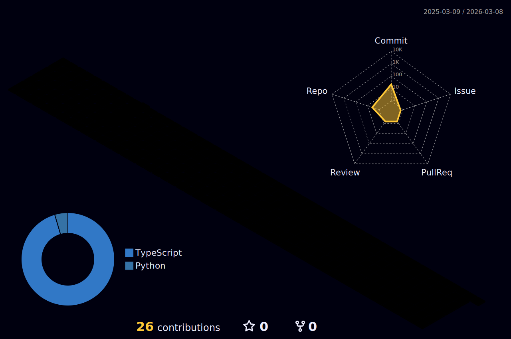

### Hi 👋, I’m 
<h3 align="center">
 </h3>

<h3>🔎 About me :</h3>

- 🏫 I'm currently studying in Vellore Institute of Technology
- 🌱 I'm currently learning **Flutter & dart, AIM & ML**
- 💬 Ask me about **[My Youtube Channel](https://www/youtube.com/c/jayvadolkar)**
- ❤️ I love Chichen Biryani and Beaches🏖️
- ⚡ Fun Fact: Recent studies show that around 70% of coding jobs have nothing to do with technology at all.

<h3>✉️  Connect with Me</h3>

 
  

<h3>🛠 Languages and Tools :</h3>

  <!-- VS Code-->
  
    
  <!-- Flutter -->
  
    
  <!-- Dart-->
  
   
  <!-- Android Studio-->
  
    
  <!-- python -->
  
  
  <!--Git-->
  
    
  <!--html-->
  
    
  <!--css-->
  
    
  

<h3>🔥 Statistics :</h3>

   
 📈 Contribution Graph 

    
   

   
🕗 WakaTime 

    
   Total time coded since May 9 2022
     
   
   
     

   
 🦾 Profile-3d-contrib 

    
   

